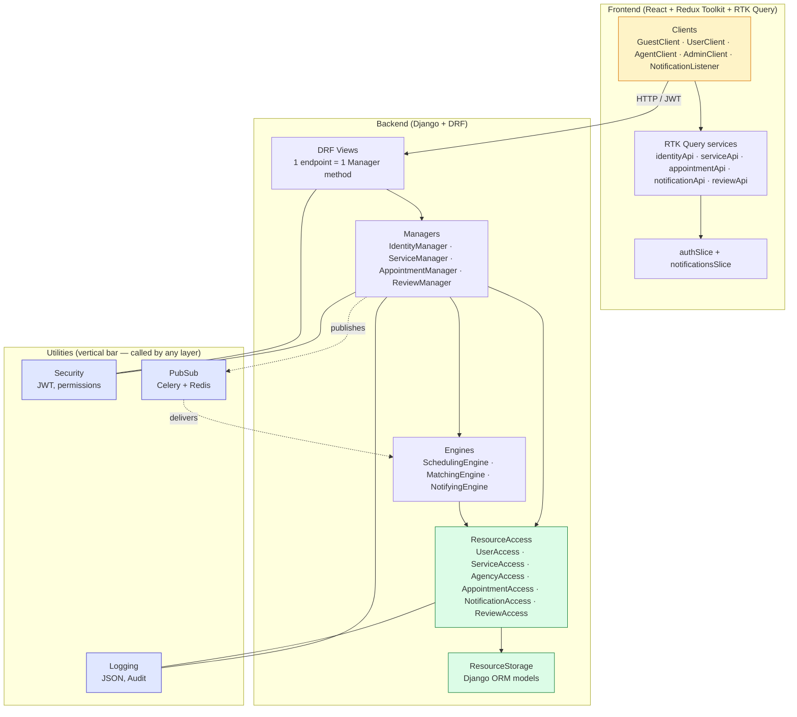
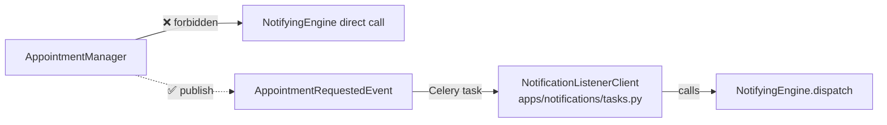
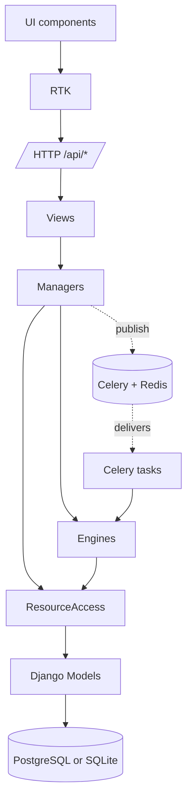

# 01 — Architecture (VBD)

BNA Digital is decomposed using **VBD — Volatility-Based Decomposition**: each layer groups what changes together at the same rate. The most stable concepts live at the bottom; the most volatile (UI) at the top. **Calls only flow downward.** Cross-domain coordination uses **PubSub events**, never direct manager-to-manager calls.

## Layered view

## Why this matters

| Layer | Volatility | Changes when… |
|---|---|---|
| ResourceStorage (models) | very low | the data model itself changes (rare) |
| ResourceAccess (`access.py`) | low | a query or a write needs to be added |
| Utilities | low | infra evolves (logging format, JWT lib) |
| Engines | medium | algorithms change (matching policy, slot duration) |
| Managers | medium | use case sequences change |
| Views (DRF) | medium | HTTP contract changes |
| Clients (UI) | very high | every UX iteration |

A change to the matching algorithm only edits `MatchingEngine`. A change to the booking page only edits the React `AppointmentForm.jsx`. Layers above don't know about layers below them.

## The downward-call rule (and PubSub exception)

Managers publish facts. Listeners (Celery tasks) dispatch them. This keeps the graph acyclic.

## VBD invariants enforced

- **Engines call only ResourceAccess + Utilities.** Never each other, never managers, never views.
- **Managers call ResourceAccess + Engines + Utilities.** Never another Manager directly.
- **Views call exactly one Manager method per request.**
- **Frontend Clients call exactly one RTK Query endpoint per user action.** Never `axios` directly.

These rules are encoded in the test suite (191 backend tests) and verified by code review on every PR.

## Dependency direction (one more view)

## Tech summary

| Concern | Technology |
|---|---|
| Backend framework | Django 4.2 |
| API | Django REST Framework 3.15 |
| Auth | `djangorestframework-simplejwt` (JWT, rotating refresh + blacklist) |
| Database | PostgreSQL 13+ in prod / SQLite in dev (env-driven, `DB_ENGINE=sqlite`) |
| Async | Celery 5.3 + Redis 7 (task queue for notifications) |
| Frontend framework | React 18 |
| Build tool | Vite 5 |
| State management | Redux Toolkit 2 + RTK Query |
| Styling | Tailwind CSS 3 |
| Testing | pytest-django, factory-boy (191 tests) |
| Animations | framer-motion |
| Date handling | date-fns |
