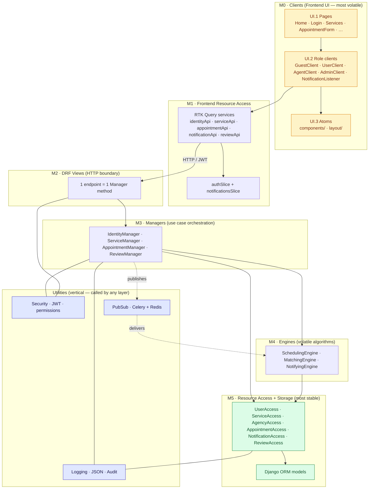
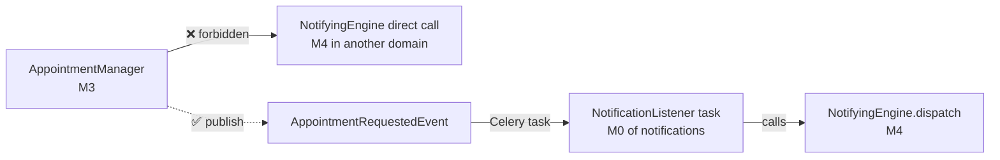
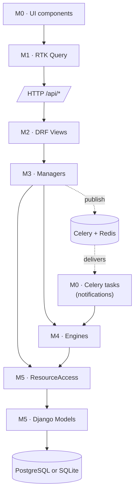

# 01 — Architecture (VBD)

BNA Digital is decomposed using **VBD — Volatility-Based Decomposition**: each layer groups what changes together at the same rate. **Calls only flow downward.** Cross-domain coordination uses **PubSub events**, never direct manager-to-manager calls.

## Layer numbering convention

Layers are numbered **top-down**: **M0 is at the top** (most volatile — UI Clients), **M5 is at the bottom** (most stable — Resource Storage). A higher number means a more stable layer. Reading the diagram from M0 to M5 follows the path of a single user action through the stack.

The UI itself is internally split into three sub-layers **UI.1 → UI.3** (most user-facing → most reusable), all collapsed inside `M0`.

```
  M0  Clients          (UI, most volatile)             ┐
       ├─ UI.1  Pages / route components                │
       ├─ UI.2  Role clients (guest / user / agent /…)  │ Frontend
       └─ UI.3  Atoms (components/, layout/)            │
  M1  Frontend Resource Access (RTK Query + slices)    ┘
  ─────────── HTTP /api/* boundary ───────────
  M2  Views        (DRF, 1 endpoint = 1 Manager method)┐
  M3  Managers     (use case orchestration)             │ Backend
  M4  Engines      (volatile algorithms)                │
  M5  Resource Access + Storage (ORM, DB)               ┘
```

## Layered view



## Why this matters

Top-to-bottom = M0 → M5 = volatile → stable. The number of times a layer changes is roughly inverse to its number.

| Layer | Layer name | Volatility | Changes when… |
|---|---|---|---|
| **M0** | Clients (UI) | very high | every UX iteration |
| **M1** | Frontend Resource Access | medium | API surface evolves, cache strategies change |
| **M2** | Views (DRF) | medium | HTTP contract changes |
| **M3** | Managers | medium | use-case sequences change |
| **M4** | Engines | medium | algorithms change (matching policy, slot duration) |
| **M5** | Resource Access + Storage | very low | data model itself changes (rare) |

A change to the matching algorithm only edits `MatchingEngine` (M4). A change to the booking page only edits the React `AppointmentForm.jsx` (M0/UI.1). Layers below don't know about layers above them.

## The downward-call rule (and PubSub exception)



Managers publish facts. Listeners (Celery tasks) dispatch them. This keeps the graph acyclic.

## VBD invariants enforced

The numbering makes the rule trivial to state: **a layer at level Mn can only call layers at levels ≥ M(n+1)**. Equivalent rules in plain English:

- **M4 Engines** call only **M5 Resource Access** + Utilities. Never each other, never M3 Managers, never M2 Views.
- **M3 Managers** call **M4 Engines + M5 Resource Access** + Utilities. Never another M3 Manager directly.
- **M2 Views** call exactly one M3 Manager method per request.
- **M0 Clients** call exactly one **M1 RTK Query** endpoint per user action. Never `axios` directly.

These rules are encoded in the test suite (194 backend tests) and verified by code review on every PR.

## Dependency direction (one more view)

Same numbering convention — M0 enters at the top, M5 lives at the bottom of the call graph.



## Tech summary

| Concern | Technology |
|---|---|
| Backend framework | Django 4.2 |
| API | Django REST Framework 3.15 |
| Auth | `djangorestframework-simplejwt` (JWT, rotating refresh + blacklist) |
| Database | PostgreSQL 13+ in prod / SQLite in dev (env-driven, `DB_ENGINE=sqlite`) |
| Async | Celery 5.3 + Redis 7 (task queue for notifications) |
| Frontend framework | React 18 |
| Build tool | Vite 5 |
| State management | Redux Toolkit 2 + RTK Query |
| Styling | Tailwind CSS 3 |
| Testing | pytest-django, factory-boy (191 tests) |
| Animations | framer-motion |
| Date handling | date-fns |
