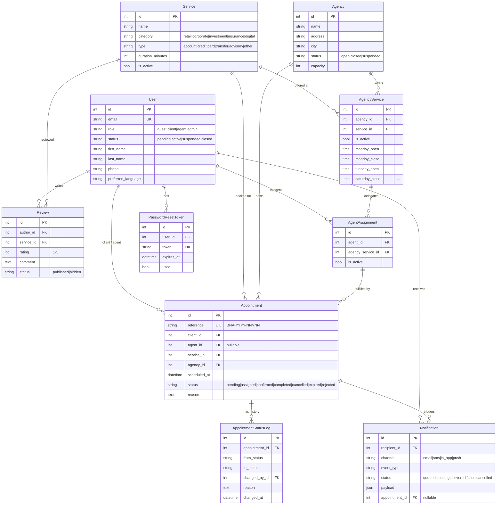
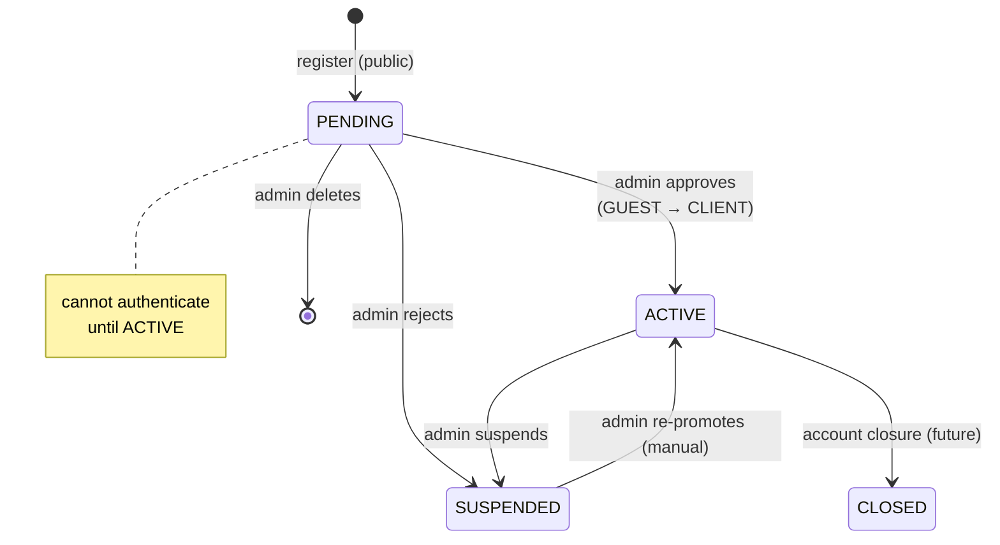
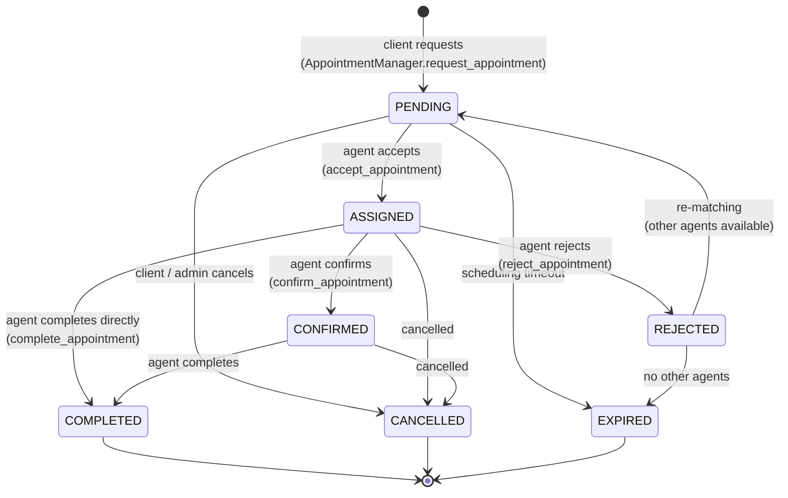
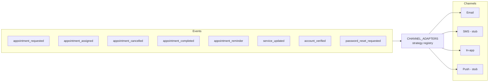

# 02 — Domain model

The five storage components (Django apps) and the relationships between them.

## Entity-relationship diagram

## User identity state machine

A user account moves through these states. Registration through public API now creates a `GUEST/PENDING` row that an admin must approve.

The role transition `GUEST → CLIENT` happens during the `PENDING → ACTIVE` move (`UserAccess.promote_to_client`).

## Appointment state machine

This is the heart of the system. All transitions are recorded immutably in `AppointmentStatusLog`.

**Cancellable states**: `PENDING`, `ASSIGNED`, `CONFIRMED`. Once `COMPLETED`, `CANCELLED`, `EXPIRED`, or `REJECTED`, the appointment is terminal.

**Updatable states**: `PENDING` only. Once an agent has been involved (`ASSIGNED+`), changing slot/service requires cancelling and re-creating (the agent has been notified).

## Permission matrix per state

| Action | Client (owner) | Other client | Agent (assigned) | Other agent | Admin |
|---|---|---|---|---|---|
| Read RDV | ✓ | ✗ | ✓ | only PENDING | ✓ |
| Cancel | ✓ (≤CONFIRMED) | ✗ | ✓ (≤CONFIRMED) | ✗ | ✓ |
| Update | ✓ (PENDING) | ✗ | ✗ | ✗ | ✓ (PENDING) |
| Accept (PENDING) | ✗ | ✗ | only if eligible | only if eligible | ✗ |
| Confirm (ASSIGNED) | ✗ | ✗ | ✓ (own) | ✗ | ✗ |
| Complete | ✗ | ✗ | ✓ (own) | ✗ | ✓ |
| Reject (ASSIGNED) | ✗ | ✗ | ✓ (own) | ✗ | ✗ |

## Notification event types

Every domain event maps to one Celery task name `apps.notifications.tasks.handle_{event_type}`.

Adding a new channel = subclassing `BaseChannelAdapter`, registering it in `CHANNEL_ADAPTERS`. Zero changes elsewhere.

## Domain invariants

These are enforced by the access layer and tested:

1. **A client can have only one PENDING/ASSIGNED/CONFIRMED appointment** at a given `(service, scheduled_at)` (uniqueness via app-level check, not DB constraint).
2. **`unique_together(author, service)` on Review** — one review per client per service.
3. **`unique_together(agency, service)` on AgencyService** — a service is offered at an agency at most once.
4. **`unique_together(agent, agency_service)` on AgentAssignment** — an agent is assigned to a (service, agency) combo at most once.
5. **`Appointment.reference` is unique** — generated at creation as `BNA-YYYY-NNNNN` with retry on collision.
6. **All FKs use `on_delete=PROTECT`** by default — deletes are conscious decisions; soft state transitions (status changes) are preferred for audit.
