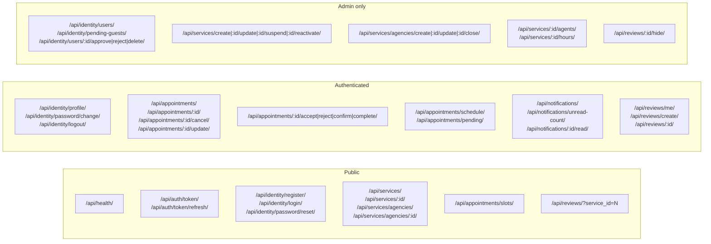
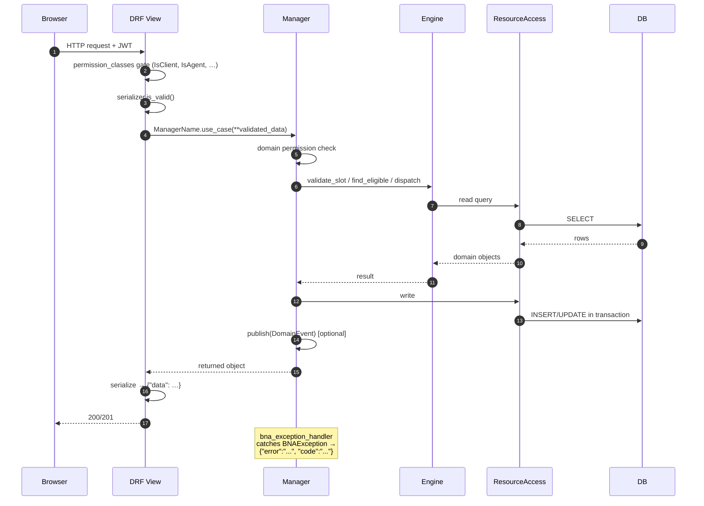
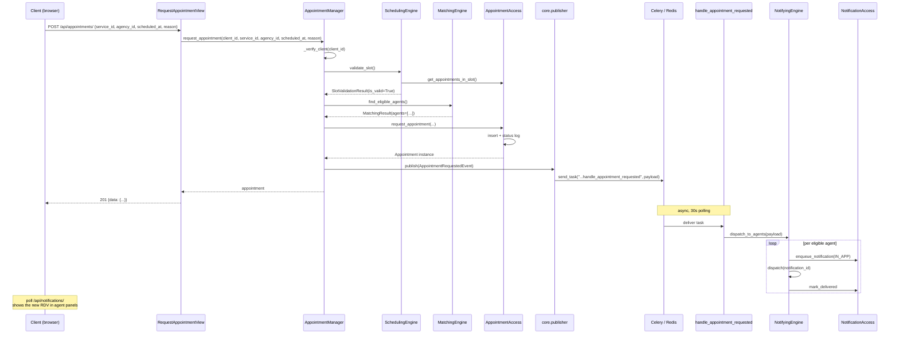
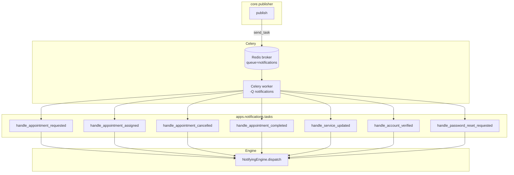
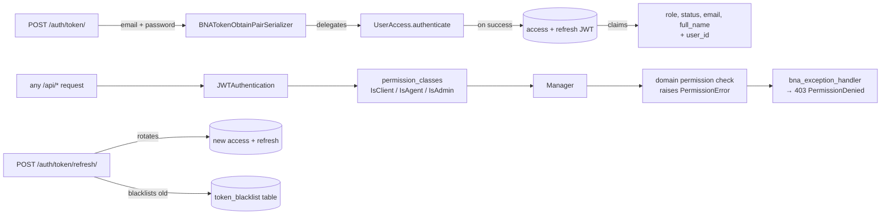

# 03 — Backend stack

Django 4 + DRF + JWT, async tasks via Celery + Redis. Five Django apps, one per domain.

## Project layout

```
bna-backend/
├── config/                       # Django project package
│   ├── settings/
│   │   ├── base.py              # shared (DB, JWT, Celery, logging, CORS)
│   │   ├── development.py       # DEBUG=True, console email
│   │   ├── production.py        # SMTP, HSTS, secure cookies
│   │   └── test.py              # CELERY_ALWAYS_EAGER=True
│   ├── urls.py                  # mounts /api/* and /admin/
│   ├── celery.py                # Celery app
│   └── __init__.py              # exports celery_app
├── apps/
│   ├── identity/                # User + PasswordResetToken
│   ├── services/                # Service + Agency + AgencyService + AgentAssignment
│   ├── appointments/            # Appointment + AppointmentStatusLog (+ Engines)
│   ├── notifications/           # Notification + Celery tasks (+ NotifyingEngine)
│   └── reviews/                 # Review
├── core/                        # cross-cutting utilities
│   ├── exceptions.py            # BNAException + DRF handler + status map
│   ├── permissions.py           # IsGuest / IsClient / IsAgent / IsAdmin / IsOwnerOrAdmin
│   ├── security.py              # BNATokenObtainPairSerializer
│   ├── events.py                # 8 frozen DomainEvent dataclasses
│   ├── publisher.py             # publish() → Celery send_task
│   ├── responses.py             # success() / created() / no_content()
│   └── logging.py               # JSON formatter + AuditMixin
├── manage.py
└── requirements/
```

Each app follows the same shape:

```
apps/{domain}/
├── models.py        # ResourceStorage
├── access.py        # ResourceAccess (the only file that touches the ORM for this domain)
├── managers.py      # Manager (use case orchestration)
├── engines/         # (when applicable) — scheduling, matching, notifying
├── views.py         # DRF APIView per use case
├── serializers.py   # input + output (separate classes)
├── urls.py          # one route per view
├── admin.py         # Django admin registration
├── tests/           # pytest unit + integration
└── migrations/
```

## URL surface



## Request flow — single API call



## End-to-end use case — client books an appointment



## PubSub layer



The convention `apps.notifications.tasks.handle_{event_type}` is enforced by tests. Adding a new event = adding a dataclass to `core/events.py` and a `@shared_task` with the matching name.

## Security



- **Access token**: 60 min, embeds `role` + `status` claims so permission classes don't hit the DB.
- **Refresh token**: 7 days, rotated and blacklisted on every refresh.
- **Custom serializer**: `BNATokenObtainPairSerializer` accepts `email` (not `username`) and reuses `UserAccess.authenticate` so the "active account check" lives in one place.

## Logging

`core.logging.BNAJsonFormatter` outputs JSON in production (parseable by Datadog/ELK) and a verbose human format in dev. Every Manager and Access class includes `AuditMixin._audit(action, actor_id, target_id, extra={…})` for sensitive writes — appointments, role changes, password resets, deletions.

```python
# apps/appointments/access.py
class AppointmentAccess(AuditMixin):
    @staticmethod
    def cancel_appointment(...):
        ... # write
        AppointmentAccess._audit(
            action='appointment_cancelled',
            actor_id=cancelled_by_id,
            target_id=appointment_id,
            extra={'reason': reason},
        )
```

`AuditMixin._audit` swallows all exceptions — logging never breaks business logic.

## Tests

191 backend tests via `pytest-django`. Run with:

```bash
DJANGO_SETTINGS_MODULE=config.settings.test .venv/bin/python -m pytest -q
```

The `test.py` settings turn on `CELERY_TASK_ALWAYS_EAGER=True` so events are processed synchronously without a real worker, and propagate `bna.*` loggers to root so `caplog` captures audit records.

Test categories:

| Layer | Tests cover |
|---|---|
| ResourceAccess | every verb, every error path |
| Engines | slot validation, conflict detection, calendar building, matching, channel adapters, retry on adapter failure |
| Managers | use-case happy paths + permission denials + state transition rules |
| Views | full HTTP envelope: 200 / 201 / 204 / 400 / 401 / 403 / 404 / 409 |
| PubSub | every event class is registered to a Celery task with the right name |
