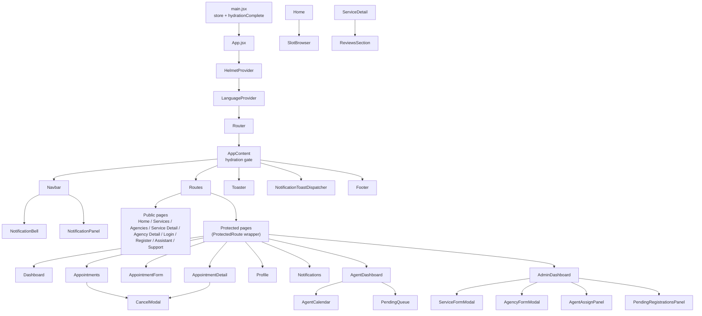
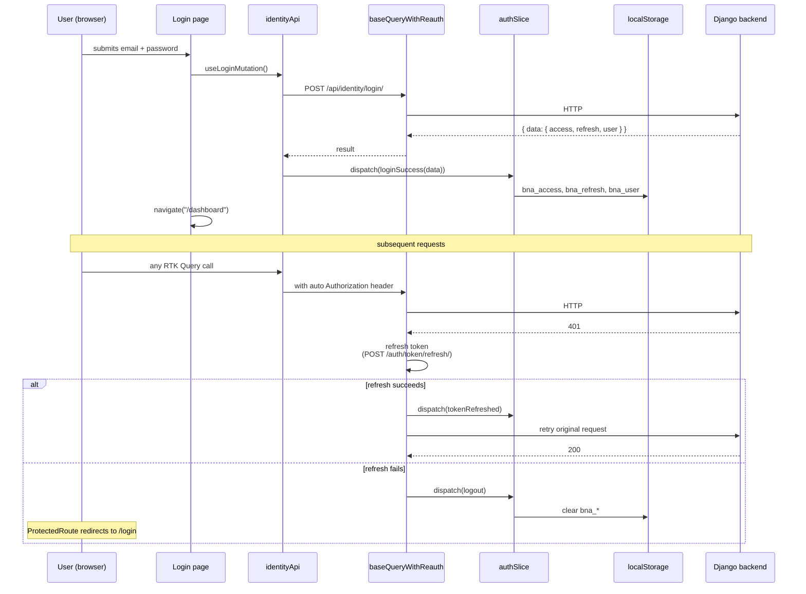
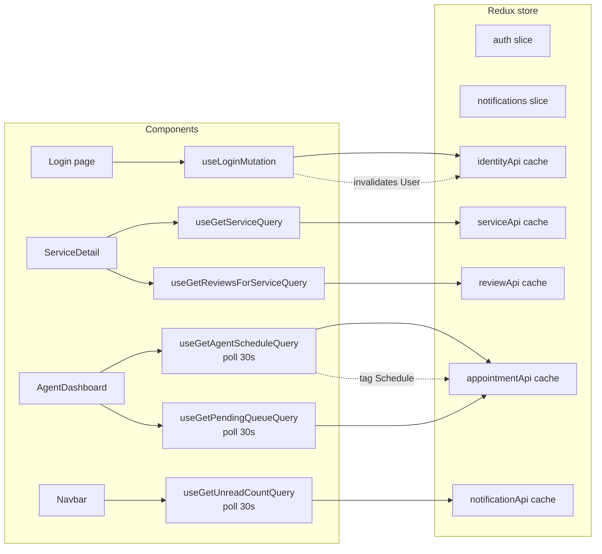
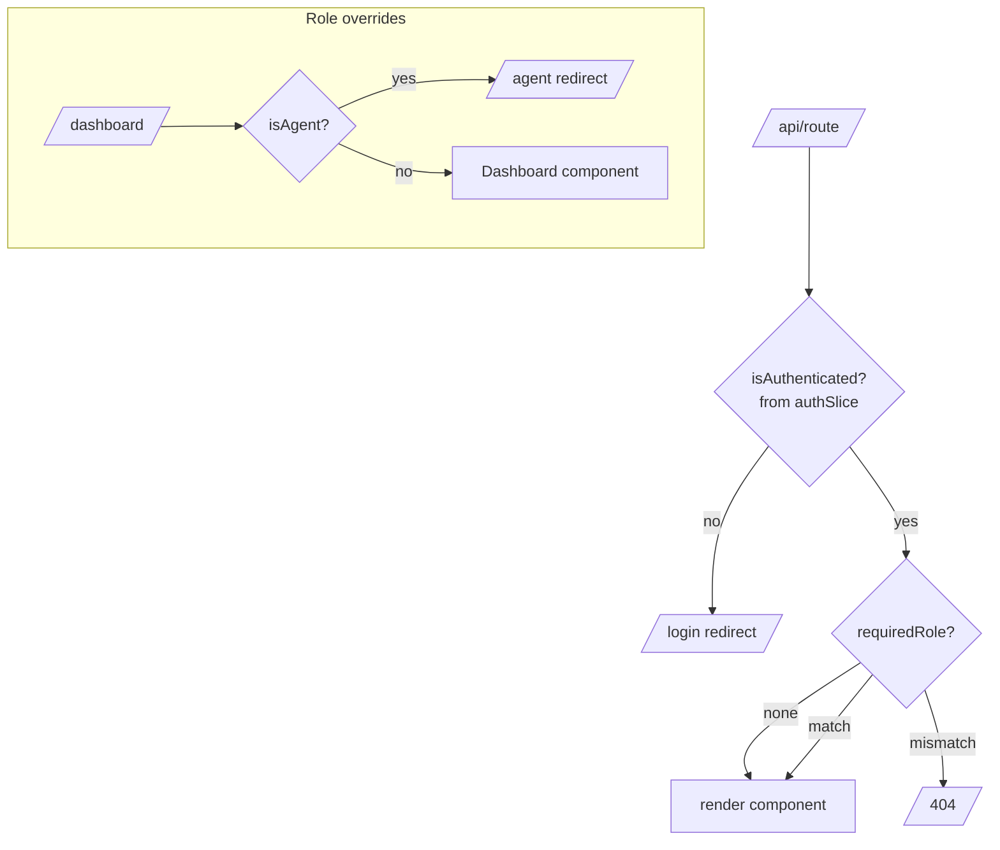
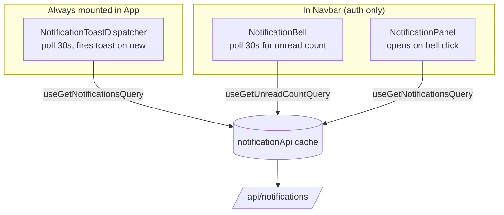
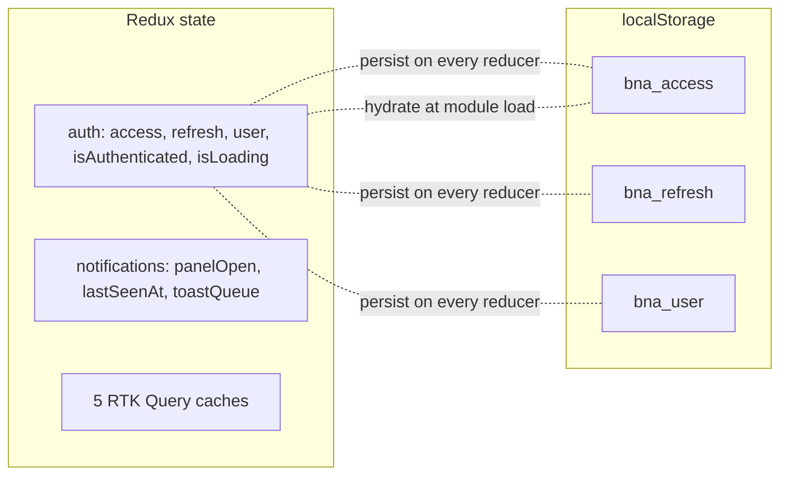

# 04 — Frontend stack

React 18 + Vite + Redux Toolkit + RTK Query. The frontend is the **VBD Client layer** — the most volatile part of the system. Components never call `axios` directly; all server state flows through five RTK Query services.

## Project layout

```
bna-frontend/
├── src/
│   ├── App.jsx                    # router + global hydration gate + ProtectedRoute
│   ├── main.jsx                   # ReactDOM.render + dispatches hydrationComplete
│   ├── index.css                  # Tailwind directives + custom utilities
│   ├── store/
│   │   ├── index.js               # configureStore (slices + 5 RTK Query reducers/middleware)
│   │   ├── hooks.js               # useCurrentUser, useIsAdmin, useIsAgent, …
│   │   ├── api/
│   │   │   └── baseApi.js         # baseQueryWithReauth + extractError
│   │   ├── slices/
│   │   │   ├── authSlice.js       # access/refresh tokens + user; persists to localStorage
│   │   │   └── notificationsSlice.js   # panel open/close, last seen, toast queue
│   │   └── services/
│   │       ├── identityApi.js     # all /api/identity/* endpoints
│   │       ├── serviceApi.js      # all /api/services/* endpoints
│   │       ├── appointmentApi.js  # all /api/appointments/* endpoints
│   │       ├── notificationApi.js # all /api/notifications/* endpoints
│   │       └── reviewApi.js       # all /api/reviews/* endpoints
│   ├── pages/                     # one component per route
│   ├── clients/                   # role-specific UI (VBD Client decomposition)
│   │   ├── guest/                 # SlotBrowser
│   │   ├── user/                  # CancelModal
│   │   ├── agent/                 # AgentCalendar (month/week/day) + PendingQueue
│   │   ├── admin/                 # ServiceFormModal + AgencyFormModal + AgentAssignPanel + PendingRegistrationsPanel
│   │   ├── reviews/               # ReviewsSection (read for guest, write for client)
│   │   └── notifications/         # NotificationBell + Panel + ToastDispatcher
│   ├── components/layout/         # Navbar + Footer
│   └── contexts/                  # LanguageContext (UI state, not server state)
├── public/
├── index.html
├── vite.config.js
├── tailwind.config.js
└── package.json
```

## Component hierarchy at runtime



## Auth flow



`authSlice` initial state hydrates **synchronously** from `localStorage` at module load, so a returning user never sees a flash of `/login`. `main.jsx` then dispatches `hydrationComplete()` to flip `isLoading=false` before the first paint.

## RTK Query — 5 services, 1 cache



Each `createApi` call defines a separate cache slice with `tagTypes` and `invalidatesTags`/`providesTags` declarations. A successful mutation refetches the queries it invalidates automatically — no manual cache management.

### Real example — accept appointment

```javascript
acceptAppointment: builder.mutation({
  query: (id) => ({ url: `/appointments/${id}/accept/`, method: 'POST' }),
  invalidatesTags: (_, __, id) => [
    { type: 'Appointment', id },  // refresh detail
    'Appointment',                 // refresh list
    'Schedule',                    // refresh calendar
  ],
})
```

When the agent clicks **Accepter**, three queries refetch automatically: the pending queue (loses the row), the detail page (now `ASSIGNED`), and the calendar (gains the slot).

## Routing & guards



`ProtectedRoute` is a 25-line component in `App.jsx` that reads `useIsAuthenticated()` and `useUserRole()`. While `useAuthIsLoading()` is `true` (sync hydration), it renders nothing — never `/login` — preventing a flash for returning users.

## Page → API mapping

| Page | RTK Query hooks |
|---|---|
| `Home.jsx` | `useGetServicesQuery`, `useGetAgenciesQuery` (via SlotBrowser) |
| `Services.jsx` | `useGetServicesQuery({category})` |
| `ServiceDetail.jsx` | `useGetServiceQuery`, `useGetAgenciesQuery({service_id})`, `useGetReviewsForServiceQuery`, `useCreateReviewMutation`, `useUpdateReviewMutation`, `useDeleteReviewMutation` |
| `Agencies.jsx` / `AgencyDetail.jsx` | `useGetAgenciesQuery`, `useGetAgencyQuery` |
| `Login.jsx` / `Register.jsx` | `useLoginMutation`, `useRegisterMutation` |
| `Profile.jsx` | `useGetProfileQuery`, `useUpdateProfileMutation`, `useChangePasswordMutation` |
| `Appointments.jsx` | `useGetAppointmentsQuery`, `useCancelAppointmentMutation` |
| `AppointmentForm.jsx` | `useGetServicesQuery`, `useGetAgenciesQuery`, `useGetAvailableSlotsQuery`, `useRequestAppointmentMutation`, `useUpdateAppointmentMutation` (edit mode), `useGetAppointmentQuery` (edit mode) |
| `AppointmentDetail.jsx` | `useGetAppointmentQuery`, `useCancelAppointmentMutation` |
| `Notifications.jsx` | `useGetNotificationsQuery`, `useMarkReadMutation` |
| `Dashboard.jsx` | `useGetAppointmentsQuery` |
| `AgentDashboard.jsx` | `useGetAgentScheduleQuery`, `useGetPendingQueueQuery`, `useAcceptAppointmentMutation`, `useRejectAppointmentMutation` |
| `AdminDashboard.jsx` | `useGetServicesQuery`, `useGetAgenciesQuery`, `useGetAgentsQuery`, `useGetPendingGuestsQuery`, `useSuspendServiceMutation`, `useReactivateServiceMutation`, `useCloseAgencyMutation`, `useCreateServiceMutation`, `useUpdateServiceMutation`, `useCreateAgencyMutation`, `useUpdateAgencyMutation`, `useAssignAgentMutation`, `useApproveGuestMutation`, `useRejectGuestMutation`, `useDeleteUserMutation` |

## Notification listener



The dispatcher tracks "seen IDs" in a ref. On the first poll it seeds the set with current notifications (no toasts on page load). On subsequent polls, any new `QUEUED` `IN_APP` row triggers a `toast(...)` once. WebSocket upgrade in a future phase replaces polling — only this layer changes.

## Build & dev

```bash
cd bna-frontend
npm install
npm run dev          # Vite on http://localhost:5173, proxies /api → :8000
npm run build        # production bundle
npm run preview      # serve the built bundle locally
```

Vite config (`vite.config.js`):

- Aliases: `@`, `@store`, `@clients`, `@components`, `@pages` for clean imports.
- `/api` proxy → `http://localhost:8000` (Django dev server) — eliminates CORS in dev.

## State persistence



Only the auth slice persists. Notification UI state is per-tab. RTK Query caches are intentionally not persisted — they refetch on app load to show the freshest data.

## What is *not* in Redux

The frontend follows the rule **"server state in RTK Query, client state in slices, UI state in components"**. So:

- Form input values → component `useState`
- `LanguageContext` (locale, RTL direction) → React context (no server side, never refetched)
- Filter selections, modal open/close → `useState` in the parent page
- Active calendar view (month/week/day) → `useState` in `AgentCalendar`
- Cursor date for navigation → `useState` in `AgentCalendar`

This keeps the Redux store lean: 2 slices + 5 query caches, nothing else.
