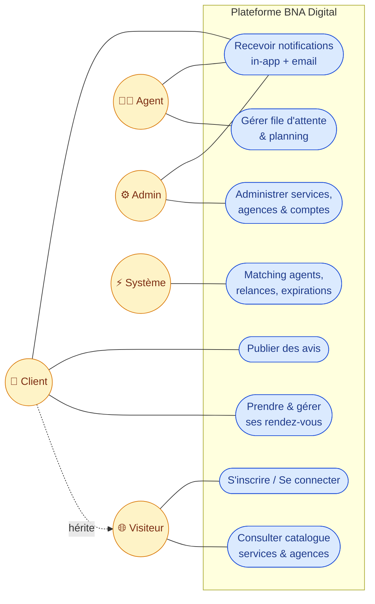
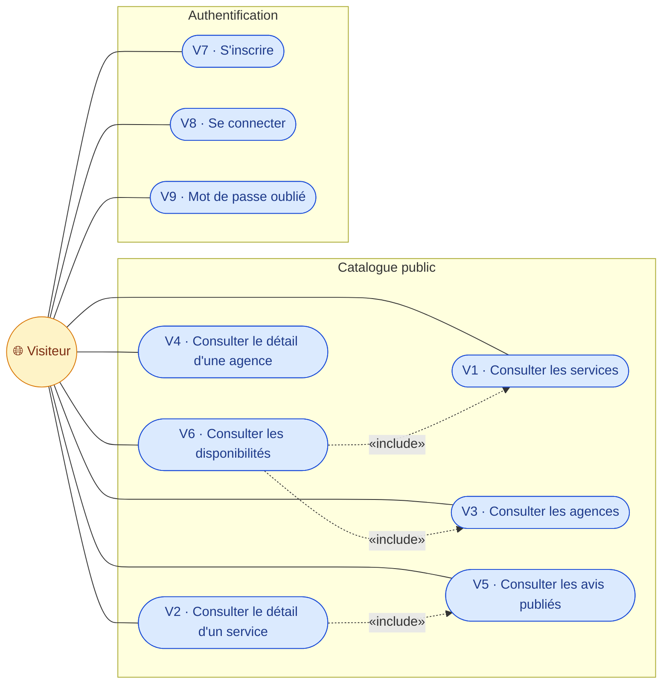
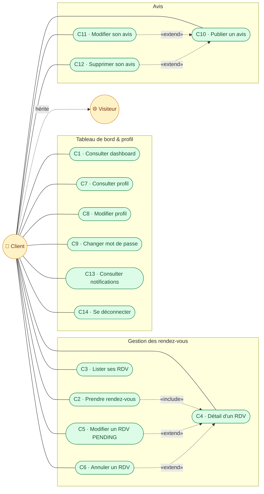
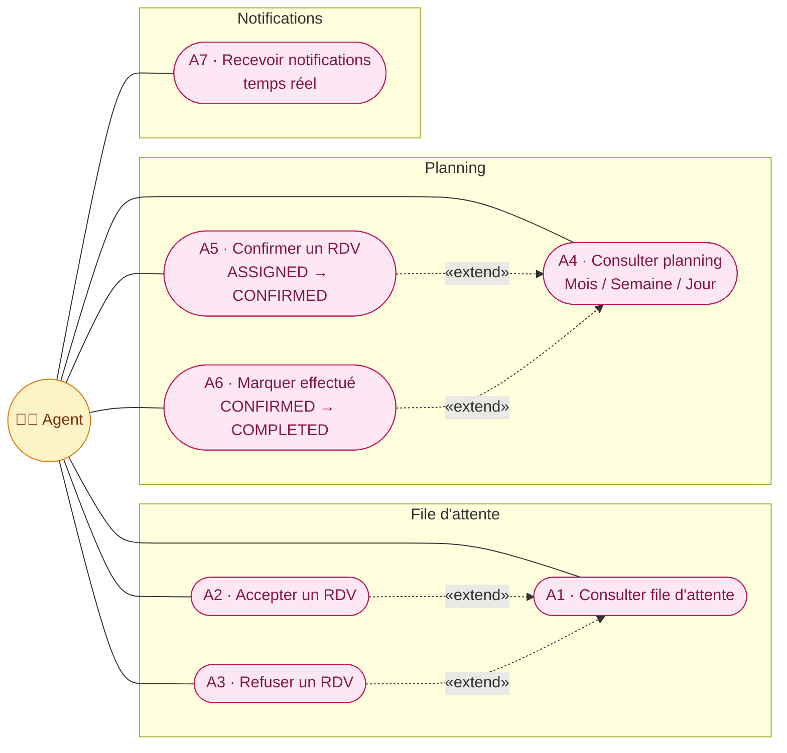
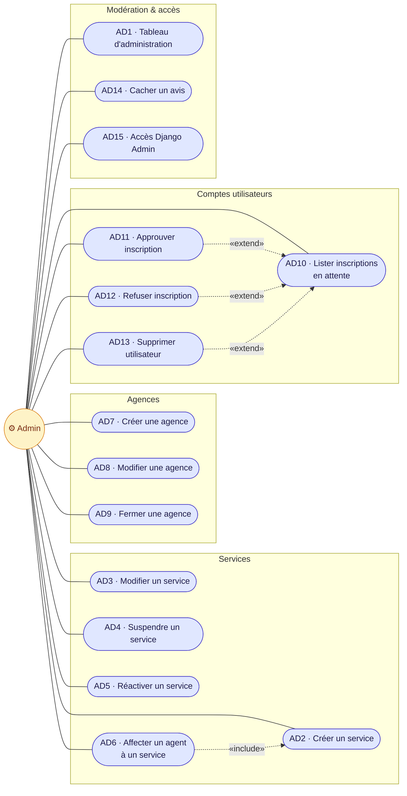
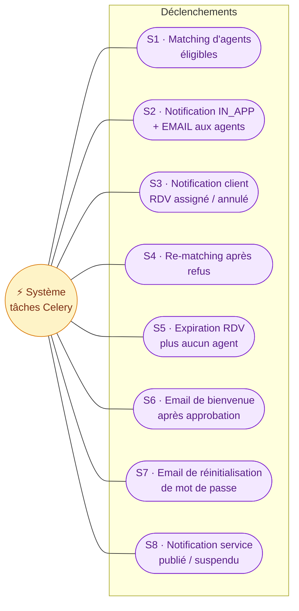
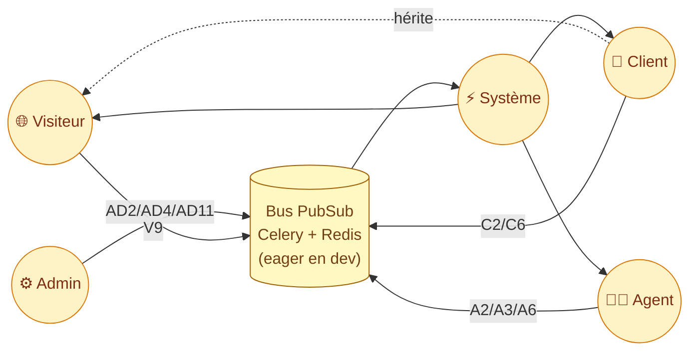

# Diagrammes de cas d'utilisation

Tous les cas d'utilisation de la plateforme BNA Digital, modélisés en
Mermaid. Le détail comportemental (« comment exercer chaque cas dans
l'interface ») est dans [`use_cases.md`](../use_cases.md) à la racine.

**Acteurs**

| Acteur | Rôle | Authentification |
|---|---|---|
| 🌐 Visiteur | consultation publique, inscription | non authentifié |
| 👤 Client | hérite Visiteur + gère ses RDV et avis | `role=client`, `status=active` |
| 🧑‍💼 Agent | gère sa file d'attente et son planning | `role=agent`, `status=active` |
| ⚙️ Admin | pilote services, agences, comptes, modération | `role=admin`, `status=active` |
| ⚡ Système | tâches Celery déclenchées par PubSub | — |

L'héritage `Client → Visiteur` signifie que le Client peut tout faire ce
que le Visiteur peut faire, en plus de ses cas propres.

---

## Vue globale

---

## Visiteur

> **V7 — S'inscrire** crée un compte `GUEST/PENDING`. L'authentification
> n'est possible qu'après approbation par un Admin (cas AD11).

---

## Client (authentifié)

Le Client hérite de tous les cas du Visiteur. La figure ci-dessous ne
montre que les cas propres au rôle Client.

> **C5 — Modifier un RDV** n'est offert qu'en statut `PENDING` (avant
> qu'un agent ne soit assigné). **C6 — Annuler** est ouvert pour
> `PENDING / ASSIGNED / CONFIRMED`.

---

## Agent

> **Règle métier** : un agent appartient à exactement une agence. Sa file
> d'attente et son planning sont scoppés à `agent.agency`.
>
> A2 / A3 déclenchent le re-matching côté `AppointmentManager` ; A3 sans
> autre agent éligible fait passer le RDV en `EXPIRED`.

---

## Admin

> **AD13 — Supprimer un utilisateur** est refusé par `on_delete=PROTECT`
> si l'utilisateur a des RDV ou avis liés. Dans ce cas, l'admin doit
> **suspendre** (changement de statut, pas de suppression).
>
> **AD6** repose sur la règle « 1 agent = 1 agence » : la première
> affectation épingle l'agence ; toute affectation à une autre agence
> est rejetée par le `ServiceManager`.

---

## Système (déclenchements PubSub)

Les cas système sont des tâches Celery déclenchées par les Managers via
`core.publisher.publish(DomainEvent)`. Ils n'ont pas d'acteur humain.

### Cartographie événement → tâche Celery

| Événement (publié par) | Tâche Celery | Cas système |
|---|---|---|
| `AppointmentRequestedEvent` (C2) | `handle_appointment_requested` | S1 + S2 |
| `AppointmentAssignedEvent` (A2) | `handle_appointment_assigned` | S3 |
| `AppointmentCancelledEvent` (C6) | `handle_appointment_cancelled` | S3 |
| `AppointmentCompletedEvent` (A6) | `handle_appointment_completed` | S3 |
| (interne) refus avec autres agents | re-publish `AppointmentRequestedEvent` | S4 |
| (interne) refus sans autre agent | transition `EXPIRED` + notif | S5 |
| `AccountVerifiedEvent` (AD11) | `handle_account_verified` | S6 |
| `PasswordResetRequestedEvent` (V9) | `handle_password_reset_requested` | S7 |
| `ServiceUpdatedEvent` (AD2/AD4/AD5) | `handle_service_updated` | S8 |

> En mode `CELERY_TASK_ALWAYS_EAGER=True` (par défaut en dev), ces tâches
> s'exécutent inline dans le process Django. En production ou en test
> async, elles partent par le broker Redis vers le worker Celery.

---

## Récapitulatif — Acteurs × cas d'utilisation

Cette dernière vue résume comment les actions humaines (côté gauche)
publient des événements sur le bus, et comment le Système (tâches
Celery) consomme ce bus pour notifier les destinataires concernés.
